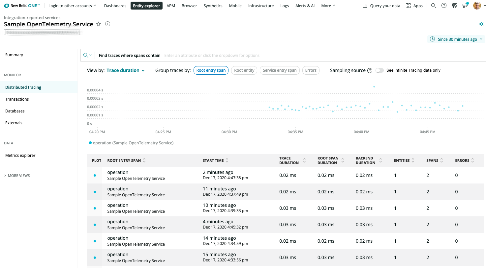
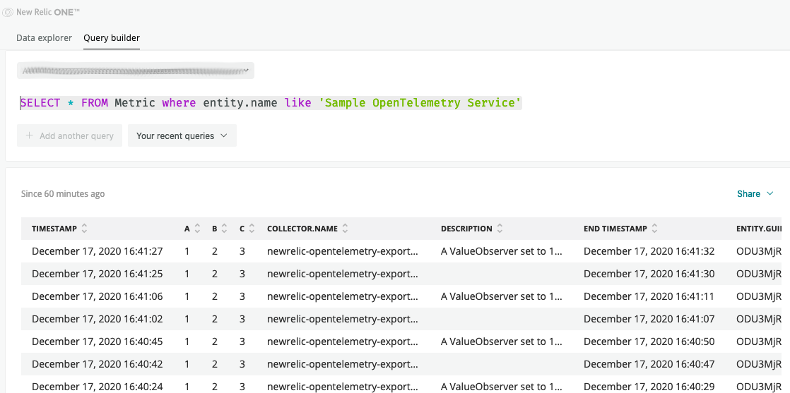

[](https://opensource.newrelic.com/oss-category/#community-plus)

# New Relic Go OpenTelemetry exporter [](https://godoc.org/github.com/newrelic/opentelemetry-exporter-go/newrelic)

The `"github.com/newrelic/opentelemetry-exporter-go/newrelic"` package
provides an exporter for sending OpenTelemetry data to New Relic.  Currently,
traces and the latest metric instruments (as of v0.13 of Open Telemetry) are
supported.


## **Getting Started**

### **Go OpenTelemetry**

OpenTelemetry is a set of vendor-neutral tools, APIs, SDKs, and an optional collector service for capturing distributed traces and metrics from your application. New Relic’s Go OpenTelemetry Exporter makes it easy for you to export your captured data to your New Relic account.

To help you get started, this guide shows you how to set up a tiny Go application to send spans and metrics to New Relic. If you have an application that already uses an existing framework like [gin](https://github.com/gin-gonic/gin) or [beego](https://beego.me/), it’s worth your time to go through the steps below, and then check out the [many auto-instrumentation options in the opentelemetry-go-contrib repository](https://github.com/open-telemetry/opentelemetry-go-contrib/tree/master/instrumentation#instrumentation).

### **Get Started**
Here’s what you need to get started exporting OpenTelemetry spans and metrics to New Relic:
* Make sure you have signed up for a [New Relic account](https://docs.newrelic.com/docs/accounts/accounts-billing/account-setup/create-your-new-relic-account).
* Obtain an [Insights Event Insert API Key](https://docs.newrelic.com/docs/telemetry-data-platform/ingest-manage-data/ingest-apis/use-event-api-report-custom-events#) to send spans and metrics to New Relic. (In that guide, you only need to proceed as far as obtaining a new key, the rest of the steps are optional.)

At this point, you have a couple of alternatives:
* If you just want to see it working quickly, we have a tiny sample application set up for you [right here](examples/simple), already set up to export data to your New Relic account. Once you have it checked out, skip to [Running the sample application](#Running-the-sample-application) in this document.
* If you’re starting from scratch, review the Go OpenTelemetry [Getting Started Guide](https://opentelemetry.io/docs/go/getting-started/). This excellent guide will walk you through creating a tiny sample application that generates spans and metrics, and outputs text to your terminal. Then [modify your sample application](#Modify-the-OpenTelemetry-sample-application) to send data to New Relic using the instructions below.

Lastly, [view your data in the New Relic One UI](#View-your-data-in-the-New-Relic-One-UI). Very satisfying!

### **Modify the OpenTelemetry sample application**
Here’s what to do to switch out the text-based exporter defined in the Go OpenTelemetry SIG’s [Getting Started Guide](https://opentelemetry.io/docs/go/getting-started/) with the New Relic OpenTelemetry Exporter for Go.

There are three steps to get it reporting to New Relic:

1. replace an import statement
1. instantiate a ```newrelic``` exporter with some configuration options
1. give the exporter time to report to New Relic.

Full source of this modified sample application is available in examples/simple/main.go.

1. Replace the exporter import clause. Switch this:

   ```go
   "go.opentelemetry.io/otel/exporters/stdout"
   ```

   ...with this:

   ```go
   "github.com/newrelic/opentelemetry-exporter-go/newrelic"
   ```


2. Rather than instantiate a ```stdout``` exporter, instantiate a ```newrelic``` exporter. Replace this:

   ```go
    exporter, err := stdout.NewExporter(
        stdout.WithPrettyPrint(),
    )
    if err != nil {
        log.Fatalf("failed to initialize stdout export pipeline: %v", err)
    }
    ctx := context.Background()
   ```
   ...with this:

   ```go
	apiKey, ok := os.LookupEnv("NEW_RELIC_API_KEY")
	if !ok {
		fmt.Println("Missing NEW_RELIC_API_KEY required for New Relic OpenTelemetry Exporter")
		os.Exit(1)
	}

	exporter, err := newrelic.NewExporter(
		"Simple OpenTelemetry Service",
		apiKey,
		telemetry.ConfigBasicErrorLogger(os.Stderr),
		telemetry.ConfigBasicDebugLogger(os.Stderr),
		telemetry.ConfigBasicAuditLogger(os.Stderr),
	)
	if err != nil {
		fmt.Printf("Failed to instantiate New Relic OpenTelemetry exporter: %v\n", err)
		os.Exit(1)
	}

	ctx := context.Background()
	defer exporter.Shutdown(ctx)
   ```

   There are four things to notice above:

   * The configuration reads the [Insights Insert Key](https://docs.newrelic.com/docs/telemetry-data-platform/ingest-manage-data/ingest-apis/use-event-api-report-custom-events#) you obtained earlier from an environment variable called ```NEW_RELIC_API_KEY```. Keep this key safe from others, since it’s both identification and authentication in one handy token.

   * This exporter uses ```Simple OpenTelemetry Service``` as its service name. This is the name you will see in the New Relic One UI.

   * The configuration turns on all the logging it can for the purposes of this demo. To have a more silent exporter with lower overhead, remove those three lines.

   * Once we have the context (```ctx```), we defer the Shutdown function so the exporter has a chance to flush any accumulated data to the New Relic [Metrics and Traces](https://newrelic.com/platform/telemetry-data-101) endpoints.

3. You'll need to add some imports to the top of the file.
   ```
   "os"
   "fmt"
   "github.com/newrelic/newrelic-telemetry-sdk-go/telemetry"
   ```

You’re now set! If you’re not using go mod, you’ll need to download the exporter using the go get command:

```
go get github.com/newrelic/opentelemetry-exporter-go
```

### **Running the sample application**
To see it in action, just use go run with the [Insights Insert API Key](https://docs.newrelic.com/docs/telemetry-data-platform/ingest-manage-data/ingest-apis/use-event-api-report-custom-events#) set in the environment:

```
NEW_RELIC_API_KEY=NRII-REPLACE_THIS_KEY run main.go
```

Note that the key above isn’t a valid key -- replace it with your own.

Run that line a couple of times to send some data into New Relic.

### **View your data in the New Relic One UI**

**To see span data**

Go to the [New Relic One UI](https://one.newrelic.com) in your web browser, click the magnifying glass in the upper right corner and type your service name, which is ```Simple OpenTelemetry Service``` if you didn't change it from the example. New Relic searches through everything your user has permissions to see and will show you a link to the application. If you’re using a web framework, you’ll see a Summary overview containing response time, throughput, and errors. To see just the spans, click the “Distributed Tracing” header on the left.



**To see metric data**

Go to the [New Relic One UI](https://one.newrelic.com) in your web browser, click the "Query your data" link in the upper right corner, select your account, and then try this query:
SELECT * FROM Metric where entity.name like 'Simple OpenTelemetry Service'




For more tips on how to find and query your data in New Relic, see [Find trace/span data](https://docs.newrelic.com/docs/understand-dependencies/distributed-tracing/trace-api/introduction-trace-api#view-data).

For general querying information, see:
- [Query New Relic data](https://docs.newrelic.com/docs/using-new-relic/data/understand-data/query-new-relic-data)
- [Intro to NRQL](https://docs.newrelic.com/docs/query-data/nrql-new-relic-query-language/getting-started/introduction-nrql)

## **This exporter is built on alpha software**

This exporter is built with the alpha release of OpenTelemetry Go client. Due
to the rapid development of OpenTelemetry, this exporter does not guarantee
compatibility with future releases of the OpenTelemetry APIs. Additionally,
this exporter may introduce changes that are not backwards compatible without a
major version increment. We will strive to ensure backwards compatibility when
a stable version of the OpenTelemetry Go client is released.


## **Support**

Should you need assistance with New Relic products, you are in good hands with several support channels.

If the issue has been confirmed as a bug or is a feature request, file a GitHub issue.

**Support Channels**

* [New Relic Documentation](LINK to specific docs page): Comprehensive guidance for using our platform
* [New Relic Community](LINK to specific community page): The best place to engage in troubleshooting questions
* [New Relic Developer](https://developer.newrelic.com/): Resources for building a custom observability applications
* [New Relic University](https://learn.newrelic.com/): A range of online training for New Relic users of every level


## **Privacy**

At New Relic we take your privacy and the security of your information seriously, and are committed to protecting your information. We must emphasize the importance of not sharing personal data in public forums, and ask all users to scrub logs and diagnostic information for sensitive information, whether personal, proprietary, or otherwise.

We define “Personal Data” as any information relating to an identified or identifiable individual, including, for example, your name, phone number, post code or zip code, Device ID, IP address, and email address.

For more information, review [New Relic’s General Data Privacy Notice](https://newrelic.com/termsandconditions/privacy).


## **Contribute**

We encourage your contributions to improve opentelemetry-exporter-go! Keep in mind that when you submit your pull request, you'll need to sign the CLA via the click-through using CLA-Assistant. You only have to sign the CLA one time per project.

If you have any questions, or to execute our corporate CLA (which is required if your contribution is on behalf of a company), drop us an email at opensource@newrelic.com.

**A note about vulnerabilities**

As noted in our [security policy](../../security/policy), New Relic is committed to the privacy and security of our customers and their data. We believe that providing coordinated disclosure by security researchers and engaging with the security community are important means to achieve our security goals.

If you believe you have found a security vulnerability in this project or any of New Relic's products or websites, we welcome and greatly appreciate you reporting it to New Relic through [HackerOne](https://hackerone.com/newrelic).

If you would like to contribute to this project, review [these guidelines](./CONTRIBUTING.md).

To [all contributors](<LINK TO contributors>), we thank you!  Without your contribution, this project would not be what it is today.  We also host a community project page dedicated to [Project Name](<LINK TO https://opensource.newrelic.com/projects/... PAGE>).


## **License**

opentelemetry-exporter-go is licensed under the [Apache 2.0](http://apache.org/licenses/LICENSE-2.0.txt) License.


## **imitations**

The New Relic Telemetry APIs are rate limited. Please reference the
documentation for [New Relic Metrics
API](https://docs.newrelic.com/docs/introduction-new-relic-metric-api) and [New
Relic Trace API requirements and
limits](https://docs.newrelic.com/docs/apm/distributed-tracing/trace-api/trace-api-general-requirements-limits)
on the specifics of the rate limits.
